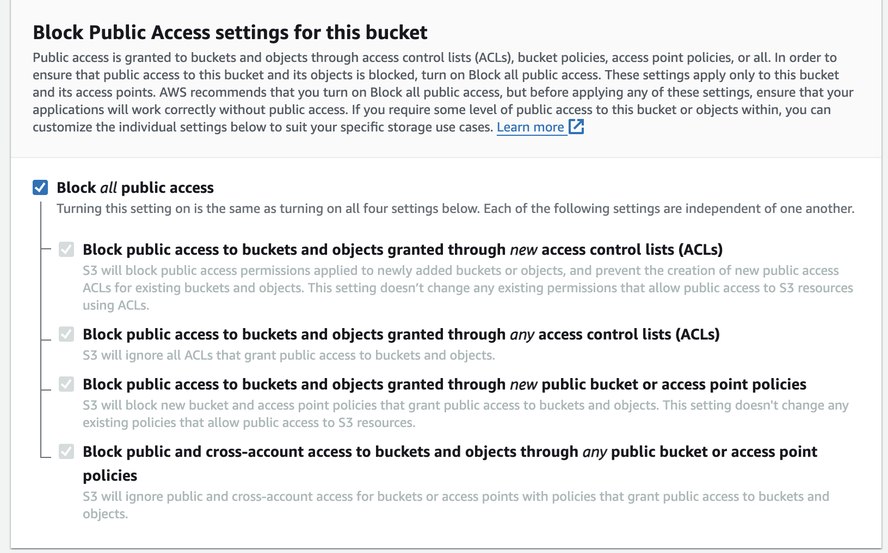
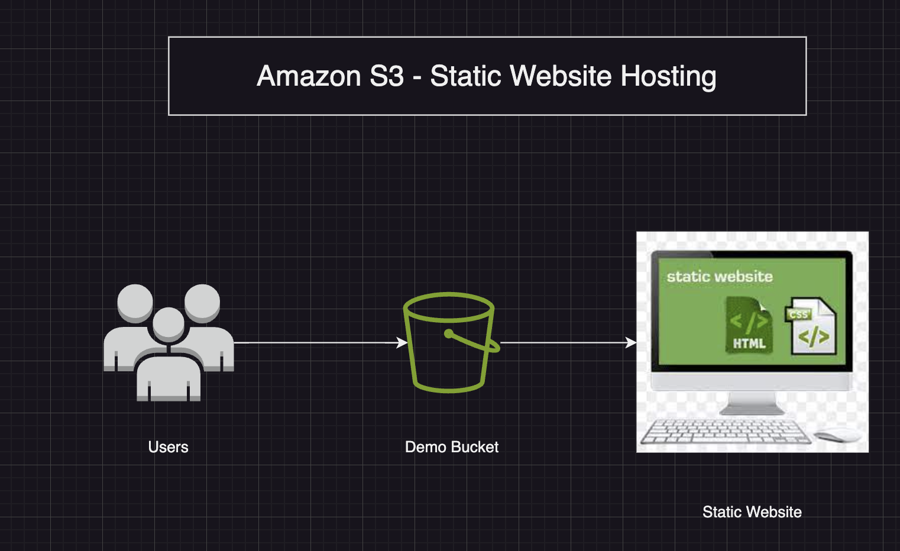
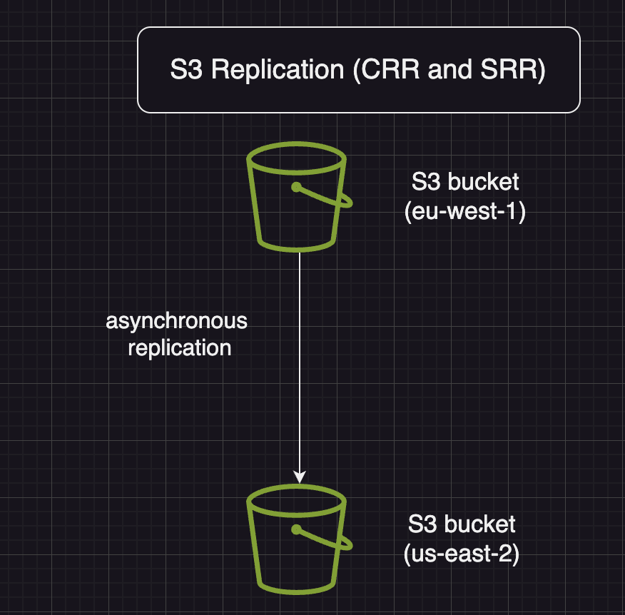

# Amazon S3 - Bucket policies

## Json Based policies: 
* Resources: buckets and objects 
* Effect: Allow/Deny
* Actions: Set of API to allow or deny
* Principal: The account or policy to apply the policy to

## Use S3 bucket for policy to: 
* Grant public access to the bucket
* Force objects to be encrypted at upload
* Grant access to another account (Cross account)

```json
{
    "Version": "2012-10-17"
    "Statement": [
        {
            "Sid" : "PublicRead",
            "Effect" : "Allow",
            "Principal" : "*",
            "Action" : ["s3:GetObject"],
            "Resource" : ["arn:aws:s3:::examplebucket/*"]
        }
    ]
}
```


# Bucket settings for Block Public Access

* These settings were created to prevent company data leaks
* If you know your bucket should never be public, leave these on
* Can be set at the account level

# Amazon S3 - Static Website Hosting

* S3 can host static websites and have them accessible on the internet
* The website URL will be depending on the region
* http://bucket-name.s3-website-aws-region.amazonaws.com
* If you get a 403 forbidden error, make sure the name of the bucket policy allows public reads!(make your bucket public)

* Two things to do
1. make your bucket public
2. Enable static web hosting

# Amazon S3 Versioning
* You can version your files in Amazon s3
* It is enabled at the bucket level
* Same key overwrite will change the "version": 1,2,3...
* It is best practice to version your buckets
    * Protect against unintended deletes (ability to restore a version)
    * Easy rollback to previous version
* Notes:
    * Any file that is not versioned prior to enabling versioning will have version "null"
    * Suspending versioning does not delete the previous versions.

# Amazon S3 - Replication (CRR & SRR)
* Must enable versioning in source and destination buckets
* Cross-Region Replication(CRR)
* Same-Region Replication (SRR)
* Buckets can be in different AWS accounts
* Copying is asynchronous
* Must give proper IAM Permissions to S3
* Use Cases:
    * CRR - compliance, lower latency access, replication accross accounts
    * SRR - log aggregation, live replication between production and test accounts
    
* Some other important points
* After you enable Replication, only new objects are replicated.
* Optionally, you can replicate existing objects using S3 Batch replication 
* Replicates existing objects and objects that failed replication
* For DELETE Operations
* Can replicate delete markers from source to target(optional setting)
* Deletions with a version ID are not replicated(to avoid malicious deletes)
* There is no `chaining` of replication
* If bucket 1 has replication into bucket 2, which has replication into bucket 3 then objects created in bucket 1 are not replicated into bucket 3.

# Storage Classes
