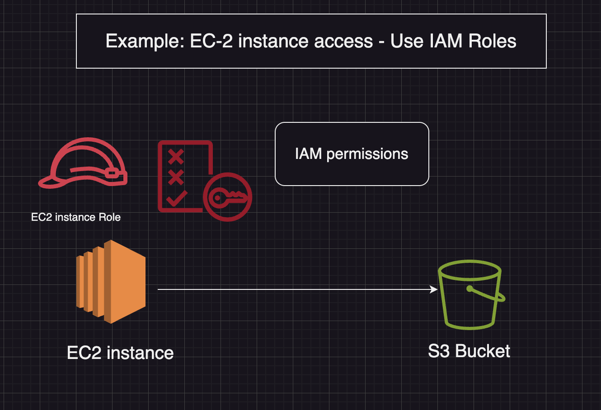
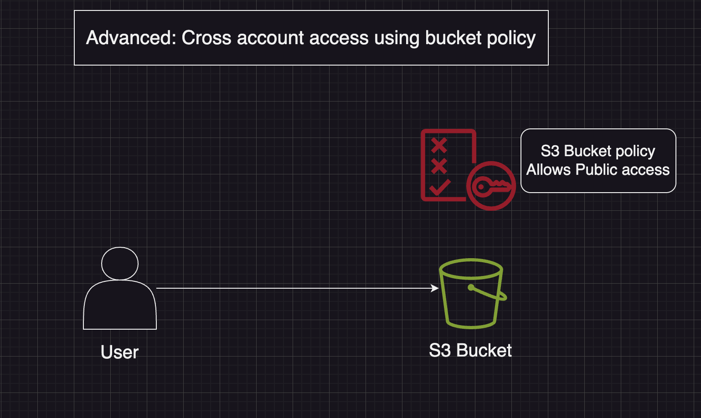

# Amazon S3 - Bucket policies

## Json Based policies: 
* Resources: buckets and objects 
* Effect: Allow/Deny
* Actions: Set of API to allow or deny
* Principal: The account or policy to apply the policy to

## Use S3 bucket for policy to: 
* Grant public access to the bucket
* Force objects to be encrypted at upload
* Grant access to another account (Cross account)

```json
{
    "Version": "2012-10-17"
    "Statement": [
        {
            "Sid" : "PublicRead",
            "Effect" : "Allow",
            "Principal" : "*",
            "Action" : ["s3:GetObject"],
            "Resource" : ["arn:aws:s3:::examplebucket/*"]
        }
    ]
}
```



